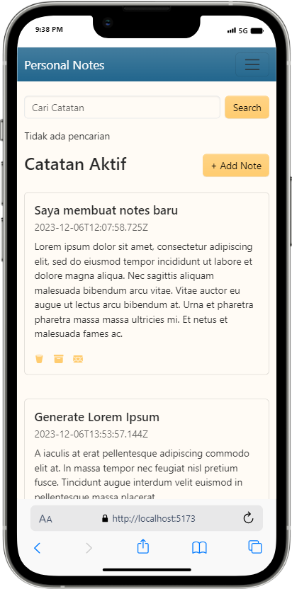
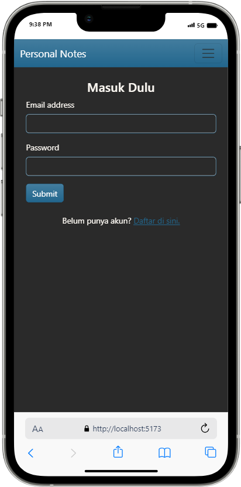
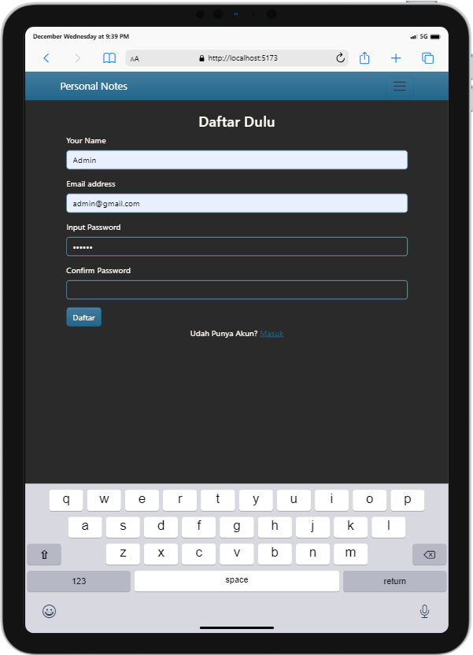
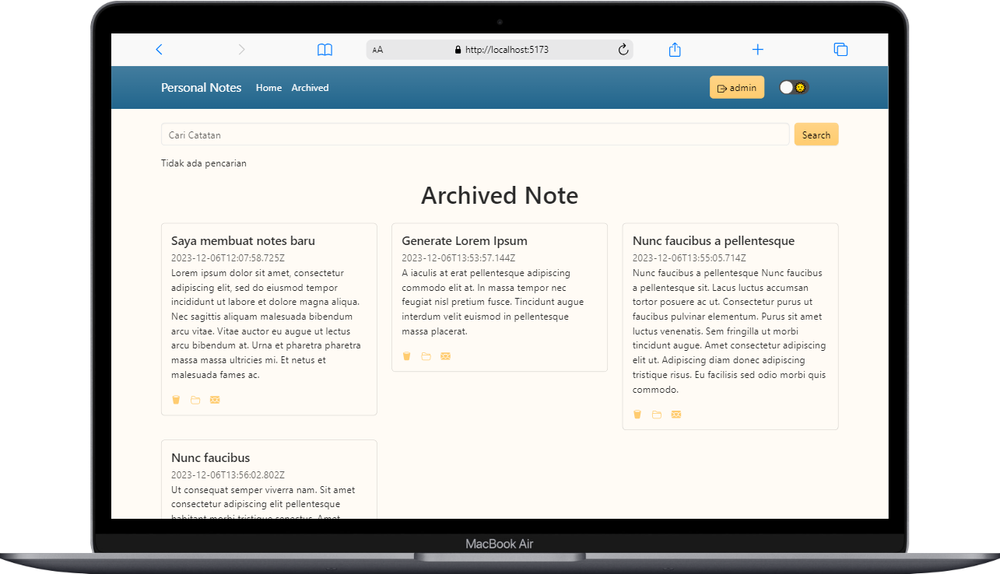
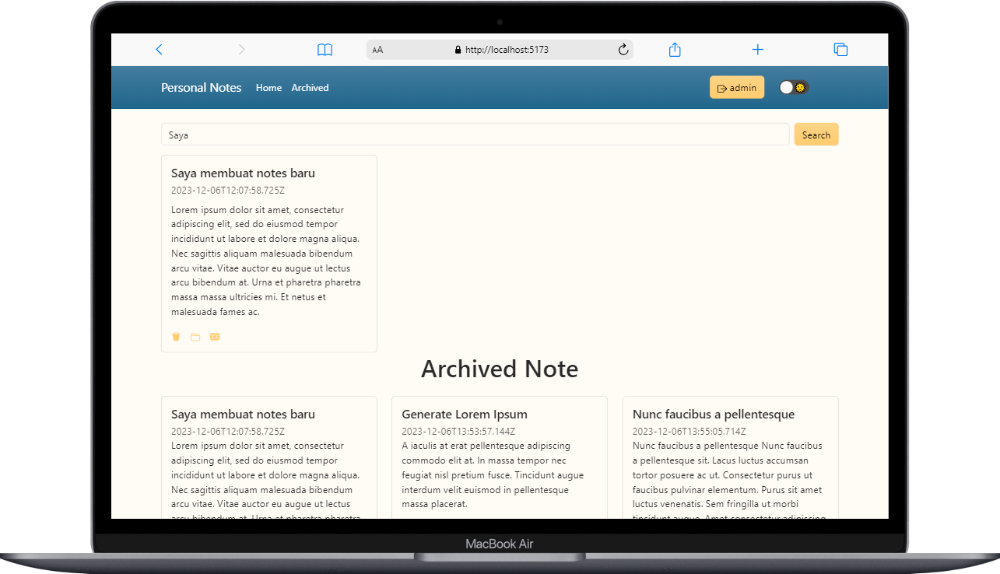
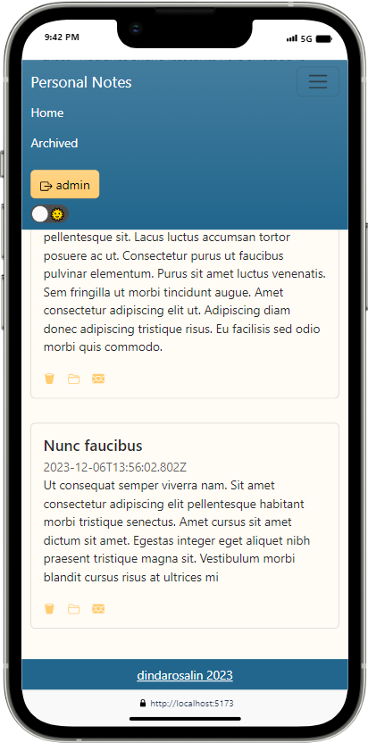

# Personal Notes

Personal Notes Web App. Aplikasi Notes menggunakan React Js dan Bootstrap.

## Clone Repository

Untuk menjalankan aplikasi ini secara lokal, silakan clone repository ini dengan menjalankan perintah berikut:

```bash
git clone https://github.com/dindarosalin/personal-notes.git
npm install
npm run dev
```

## Tools
1. React Js
2. Bootstrap
3. RESTful API https://notes-api.dicoding.dev/v1.

## Features
1. Login, Register & Logout
2. Dark/Light Mode
3. Create Note
4. View Note
5. Search Note
6. Archive/Unarchive Note
7. Delete Note

## UI






